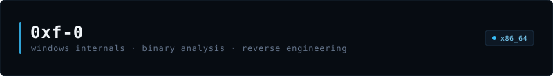

<div align="center">

  

  <br/><br/>

  <a href="https://github.com/0xf-0">
    
  </a>

  <br/><br/>

  
  
  
  
  

</div>

<br/>

```x86asm
; [0xf-0] session entrypoint
_start:
    sub     rsp, 0x28
    lea     rcx, [rip + memory_targets]     ; mem-hunt, hook-scanner, indirect-syscall
    call    reconstruct_vftable
    test    rax, rax
    jz      .breakpoint
    ret

.breakpoint:
    int3    ; trap
```

<br/>

<div align="center">
  
  
</div>

<br/>

<p align="center">
  <samp><sub><code>0x00007FFB86208A00 | 48 89 5C 24 10 48 89 74 24 18 57 48 83 EC 20</code></sub></samp>
</p>
